Nessa primeira etapa será criada a infraestrutura da rede do Projeto. Serão criados manualmente, 2 Sub-redes públicas e 4 Sub-redes privadas, Tabelas de Rota, Gateway de Rede e NAT Gateway.

----------------------------------------

1.1 - **Criar a VPC** 
Acesse a aba de VPC seguindo o caminho **AWS > VPC > Suas VPCs > Criar VPC**

- Selecione **Somente VPC**
- Tag de nome: `wordpress-vpc`
- Bloco CIDR IPv4: Entrada manual de CIDR IPv4 ✅
- CIDR IPv4: `10.0.0.0/16`
- Bloco CIDR IPv6: Nenhum bloco CIDR IPv6
- Locação: Padrão ✅

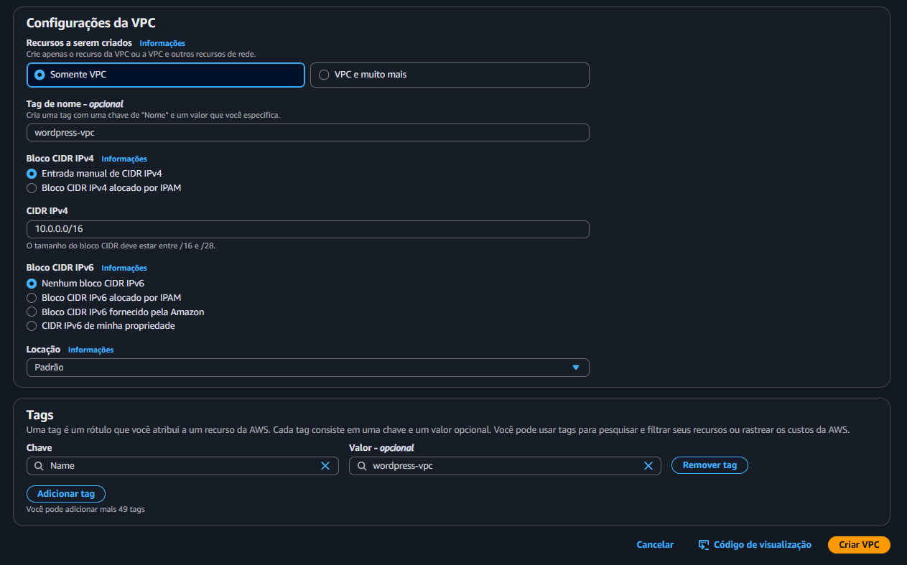

1.2 - **Criar sub-rede**
No canto esquerdo da tela onde está escrito Painel da VPC procure por Sub-redes e clique em Criar sub-rede

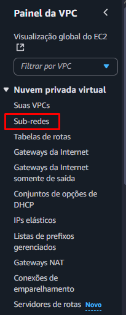

Selecione a sua VPC criada e clique em Adicionar nova sub-rede
- **WordPress-Public-1**
    - Zona de Disponibilidade: `us-east-2a`
    - Bloco CIDR IPv4 da sub-rede: `10.0.1.0/24`
- **WordPress-Public-2**
    - Zona de Disponibilidade: `us-east-2b`
    - Bloco CIDR IPv4 da sub-rede: `10.0.2.0/24`
- **WordPress-Private-1**
    - Zona de Disponibilidade: `us-east-2a`
    - Bloco CIDR IPv4 da sub-rede: `10.0.3.0/24`
- **WordPress-Private-2**
    - Zona de Disponibilidade: `us-east-2b`
    - Bloco CIDR IPv4 da sub-rede: `10.0.4.0/24`
- **WordPress-Private-3**
    - Zona de Disponibilidade: `us-east-2b`
    - Bloco CIDR IPv4 da sub-rede: `10.0.5.0/24`
- **WordPress-Private-4**
    - Zona de Disponibilidade: `us-east-2b`
    - Bloco CIDR IPv4 da sub-rede: `10.0.6.0/24`

Ao finalizar, clique em Criar sub-rede

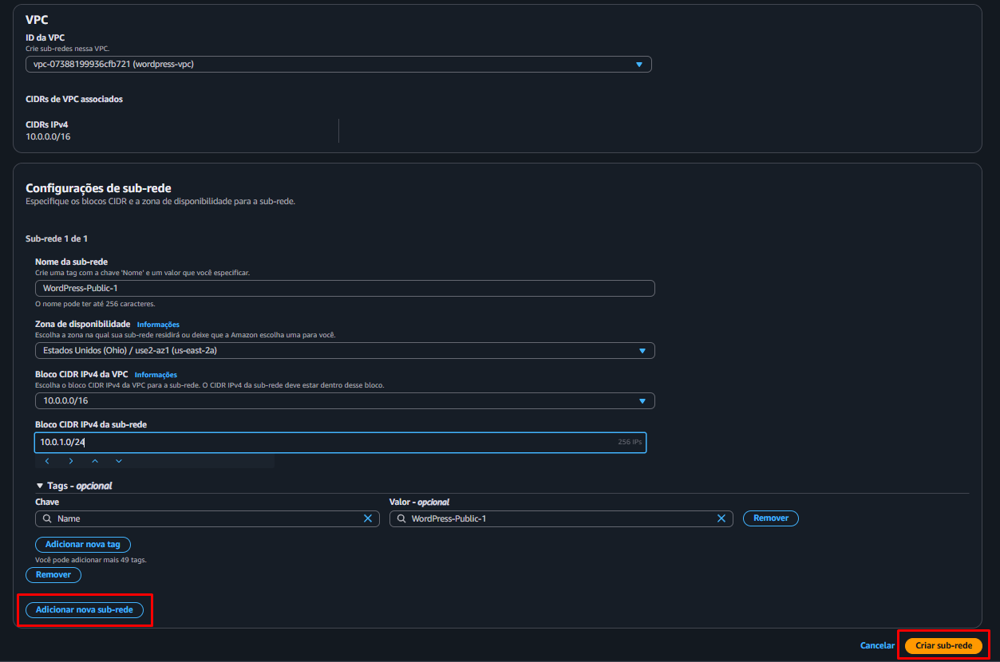
1.3 - **Criar NAT Gateway**
No Painel da VPC procure por Gateways NAT e clique em Criar gateway NAT
- **Nome:** `NAT-Wordpress`
- **Sub-rede:** `WordPress-Public-1`
- **Tipo de conectividade:** Público ✅
- **ID de Alocação do IP elástico:** Alocar IP elástico ✅
(Consome muitos créditos, atenção)

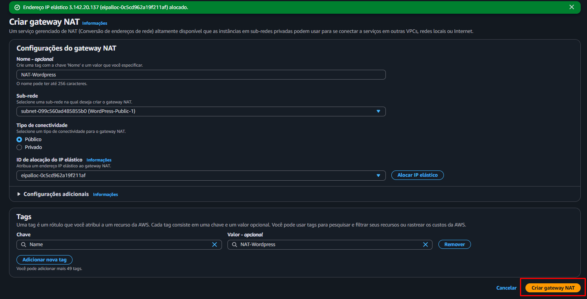
1.4 - **Criar Gateway da Internet**
No painel da VPC procure por  **Gateway da Internet** e clique em Criar Gateway da Internet
- Nome: WordPress-IGW

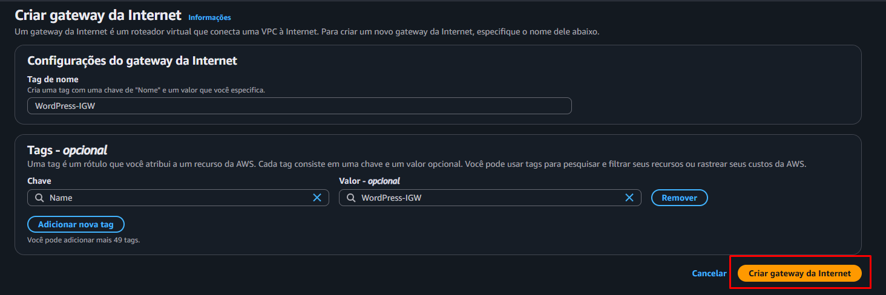
Ao criar, localize o botão azul escrito **Ações** e selecione Associar à VPC. Selecione a sua VPC e clique em Associar gateway da Internet
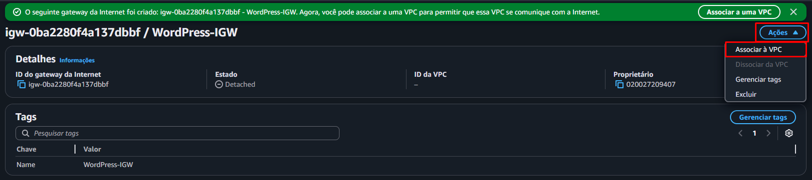

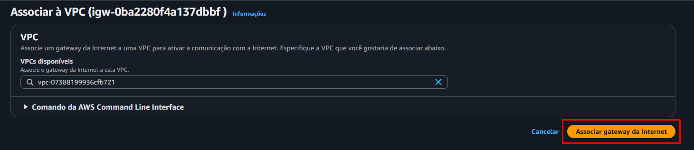

1.5 - Criar **Tabela de Rotas**
No painel da VPC procure por **Tabelas de Rotas** e clique em Criar Tabela de Rotas
- Nome: Rotas-Public-Wordpress
- VPC: WordPress-VPC
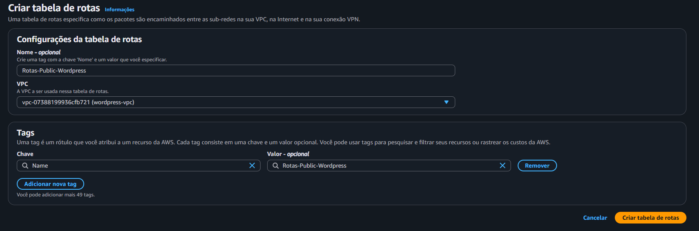
Ao ser criado, na aba de Rotas procure por **Editar Rotas**
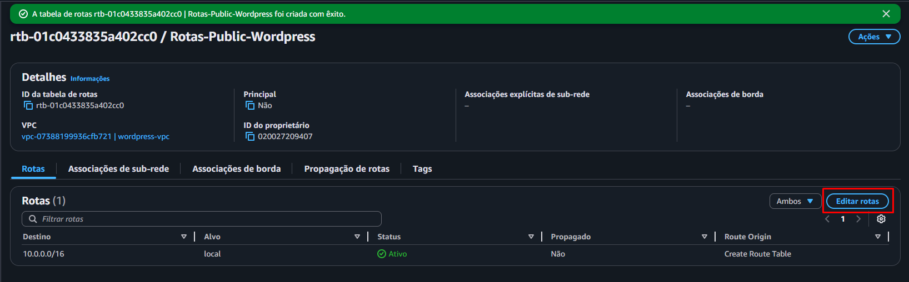
Por se tratar da tabela de rotas pública, é necessário criar essa rota com o Gateway da Rede
Clique em **Adicionar rota**
- Em destino: **0.0.0.0/0**
- Alvo: Gateway da Internet > Opção criada
Ao finalizar, clique em **Salvar Alterações**
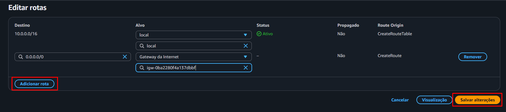
Ainda na mesma Tabela de Rotas, procure por **Associações de sub-rede** e clique em **Editar associações de sub-rede**
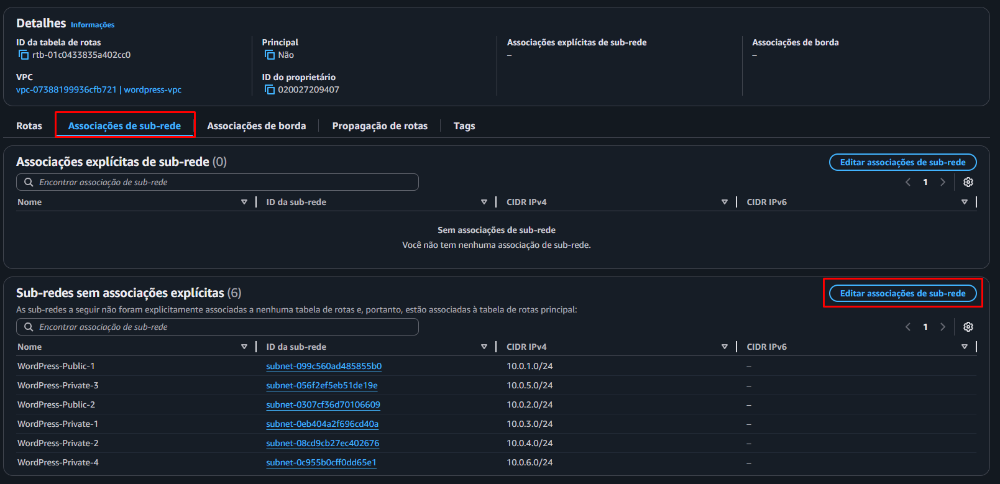
Ao acessar a nova aba, marque a **2 sub-redes PÚBLICAS**, quando selecionar, clique em Salvar associações
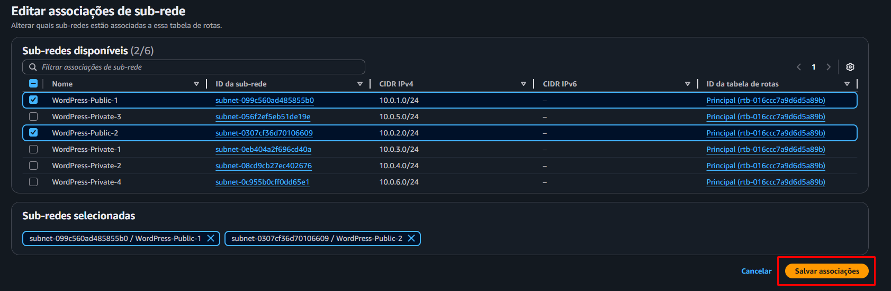
Retorne ao inicio da aba de **Tabelas de Rotas** e crie uma nova Tabela
- Nome: Rotas-Private-Wordpress
- VPC: WordPress-VPC
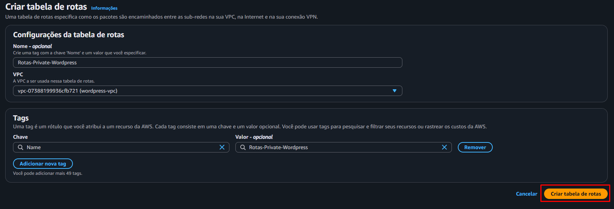
Siga os mesmos passos de Edição de Rotas, ao chegar na aba de edição adicione uma rota
- Em destino: **0.0.0.0/0**
- Alvo: Gateway NAT > Opção criada
Ao finalizar, clique em **Salvar Alterações**
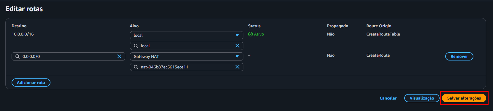
Agora associe a essa nova Tabela de Rotas privada as **sub-redes PRIVADAS**
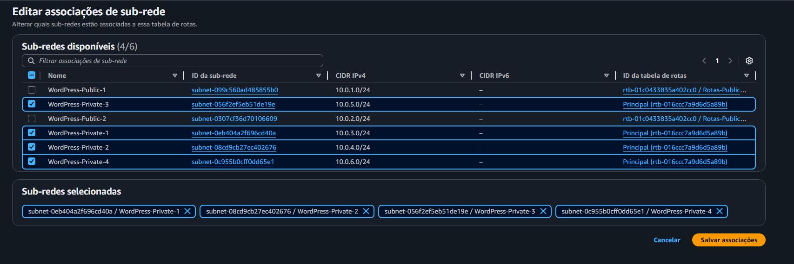
