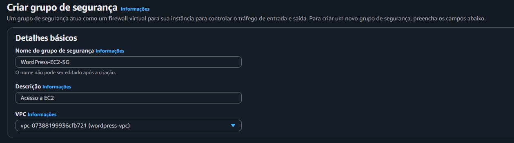
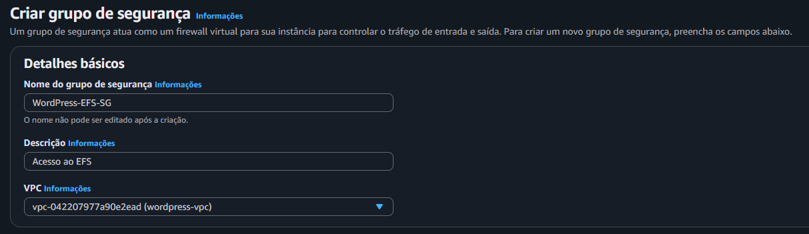
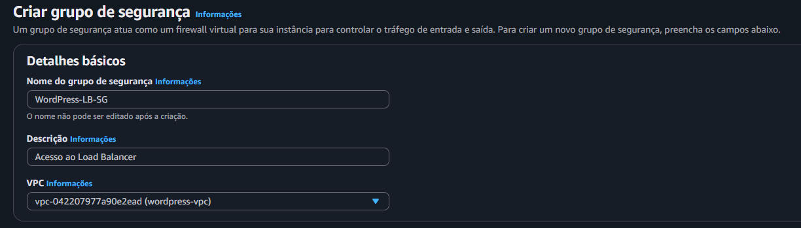
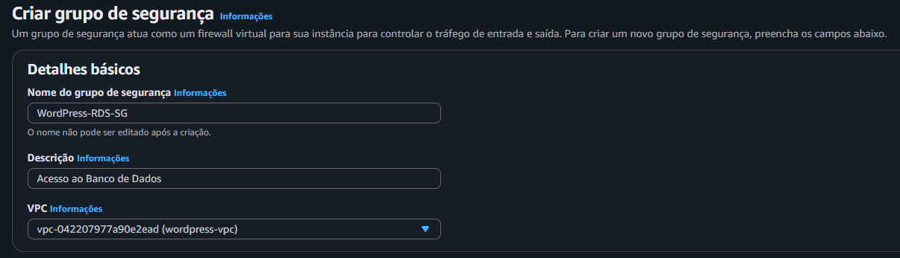
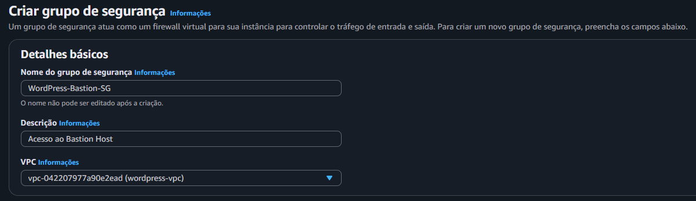
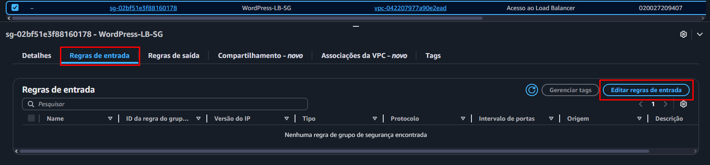
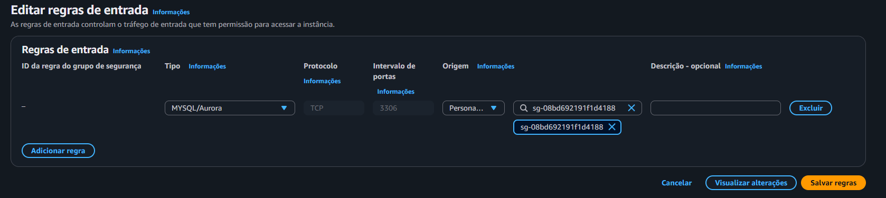
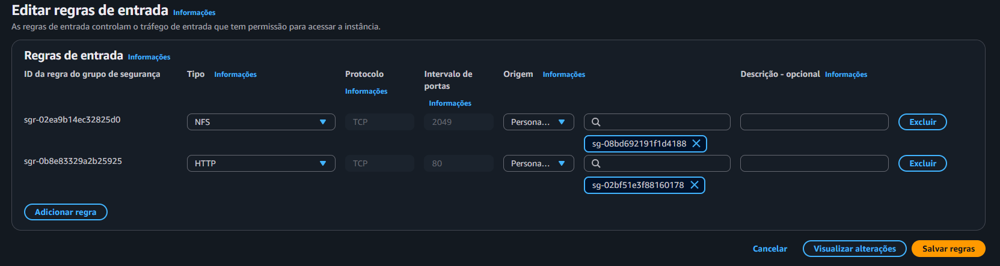
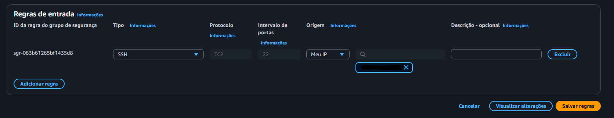

Nessa segunda etapa, serão criados os grupos de segurança com suas respectivas regras para funcionar de forma correta e segura

1 - Criar Grupo de segurança
No painel da VPC procure por Grupos de Segurança e clique em **Criar grupo de segurança**
Crie os grupos sem nenhuma regra inicialmente.

**Instâncias EC2**
- Nome: WordPress-EC2-SG
- Descrição: Acesso a EC2
- VPC: wordpress-vpc

**Elastic File System**
- Nome: WordPress-EFS-SG
- Descrição: Acesso ao EFS
- VPC: wordpress-vpc

**Load Balancer**
- Nome: WordPress-LB-SG
- Descrição: Acesso ao Load Balancer
- VPC: wordpress-vpc

**Banco de dados (MySQL - RDS)**
- Nome: WordPress-RDS-SG
- Descrição: Acesso ao Banco de Dados
- VPC: wordpress-vpc

**Bastion Host**
- Nome: WordPress-Bastion-SG
- Descrição: Acesso ao Bastion Host
- VPC: wordpress-vpc

-------------------------------------------------------------
2 - Configurar as regras de cada grupo
Na aba de Grupos de segurança
**VPC > Painel VPC > Grupos de segurança**
Selecione um grupo e localize abaixo **Regras de entrada > Editar regras de entrada**
Ao finalizar as Regras de entrada, localize **Regras de saída > Editar regras de saída**

`LB-SG` - **Load Balancer**
**Regras de Entrada**

| Tipo  | Porta | Origem              | Motivo                          |
| :---- | :---- | :------------------ | :------------------------------ |
| HTTP  | 80    | Qualquer local-IPv4 | Permite tráfego HTTP para o LB  |
| HTTPS | 443   | Qualquer local-IPv4 | Permite tráfego HTTPS para o LB |

**Regras de saída**
(Caso já esteja criado, apenas mantenha)

| Tipo           | Porta | Origem    | Motivo                              |
| :------------- | :---- | :-------- | :---------------------------------- |
| Todo o tráfego | Tudo  | 0.0.0.0/0 | Permite tráfego para qualquer opção |

`RDS-SG` - **Banco de Dados - RDS**

| Tipo         | Porta | Origem | Motivo                                          |
| :----------- | :---- | :----- | :---------------------------------------------- |
| MYSQL/Aurora | 3306  | EC2-SG | Permite acesso ao RDS apenas das instâncias EC2 |

**Regras de saída**
(Caso já esteja criado, apenas mantenha)

| Tipo           | Porta | Origem    | Motivo                              |
| :------------- | :---- | :-------- | :---------------------------------- |
| Todo o tráfego | Tudo  | 0.0.0.0/0 | Permite tráfego para qualquer opção |

`EC2-SG` - **Instâncias**

| Tipo | Porta | Origem | Motivo                                                                          |
| :--- | :---- | :----- | :------------------------------------------------------------------------------ |
| NFS  | 2049  | EC2-SG | Permite que a instância se comunique com o EFS                                  |
| HTTP | 80    | LB-SG  | Permite apenas o tráfego que já passou pelo seu ALB possa chegar às instâncias. |

**Regras de saída**
(Caso já esteja criado, apenas mantenha)

| Tipo           | Porta | Origem    | Motivo                              |
| :------------- | :---- | :-------- | :---------------------------------- |
| Todo o tráfego | Tudo  | 0.0.0.0/0 | Permite tráfego para qualquer opção |

`EFS-SG` - **Elastic Fyle System**
**Regras de Entrada**

| Tipo | Porta | Origem | Motivo                                         |
| :--- | :---- | :----- | :--------------------------------------------- |
| NFS  | 2049  | EC2-SG | Permite que a instância se comunique com o EFS |

**Regras de saída**
(Caso já esteja criado, apenas mantenha)

| Tipo           | Porta | Origem    | Motivo                              |
| :------------- | :---- | :-------- | :---------------------------------- |
| Todo o tráfego | Tudo  | 0.0.0.0/0 | Permite tráfego para qualquer opção |

`Bastion-SG` - **Bastion Host**
**Regras de Entrada**

| Tipo | Porta | Origem | Motivo                                    |
| :--- | :---- | :----- | :---------------------------------------- |
| SSH  | 22    | Meu IP | Permite que acesse somente da sua máquina |

**Regras de saída**
(Caso já esteja criado, apenas mantenha)

| Tipo           | Porta | Origem    | Motivo                              |
| :------------- | :---- | :-------- | :---------------------------------- |
| Todo o tráfego | Tudo  | 0.0.0.0/0 | Permite tráfego para qualquer opção |
