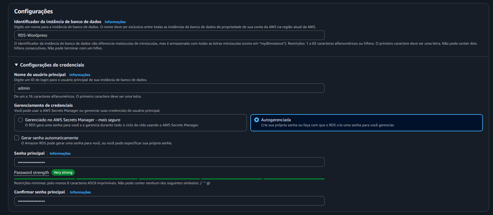

Nessa etapa, será criado o banco de dados
Acesse a AWS, busque na barra de pesquisa por **Aurora and RDS**
Antes de criar um banco de dados, busque no painel a esquerda **Grupo de sub-redes**

**Crie um grupo contendo todas as sub-redes privadas**
- Nome: RDS-GrupoPrivado
- Descrição: Grupo privado
- VPC: wordpress-vpc
- Zonas de disponibilidade: us-east-2a✅ us-east-2b✅
- Sub-redes: Selecione todas as Privadas ✅

A esquerda do painel, clique em banco de dados, após isso, cliquem em Criar um banco de dados

**Configurações do Banco de Dados**
- Opções de mecanismo: MySQL ✅
- Modelo: Nível gratuito ✅
- Disponibilidade e durabilidade: Single AZ1 ✅

**Configurações de Credenciais e instância**
- Identificador do cluster de banco de dados: RDS-Wordpress
- Nome do usuário principal: admin
- Senha principal: `<sua senha>` 
- Confirmar senha
- Configuração de instância: db.t3.micro ✅

**Conectividade**
- Nuvem privada virtual(VPC): wordpress-vpc ✅
- Grupo de sub-redes de banco de dados: rds-grupoprivado ✅
- Grupo de segurança da VPC existentes: WordPress-RDS-SG ✅ (exclua o default)
- Zona de disponibilidade: us-east-2b ✅

⚠ **IMPORTANTE** ⚠
Configuração adicional
Opções de banco de dados > Nome do banco de dados inicial: databasewordpress ✅

Após finalizar essas configurações, clique em criar banco de dados e aguarde finalizar pois demora.