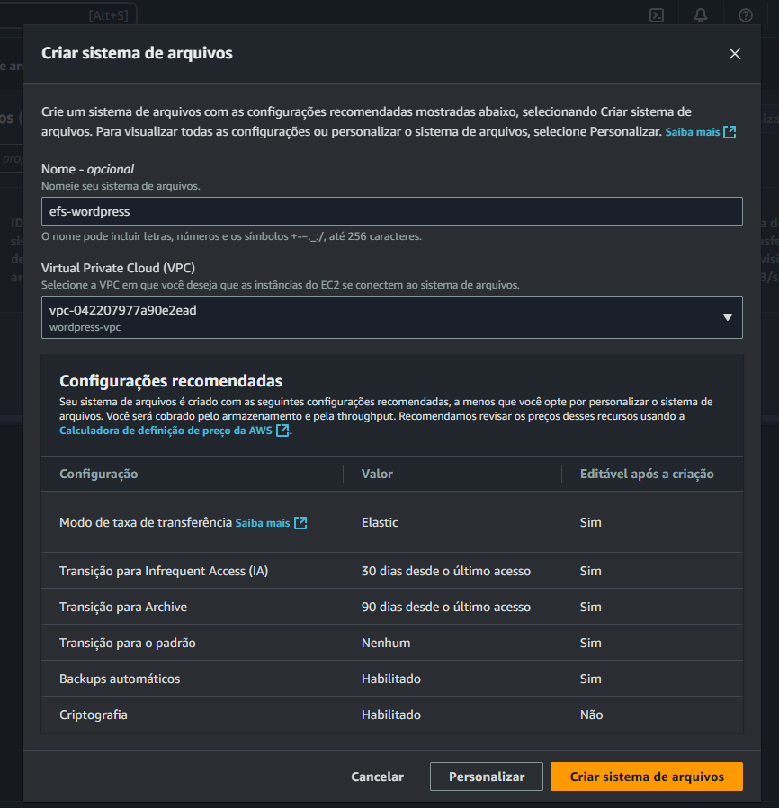
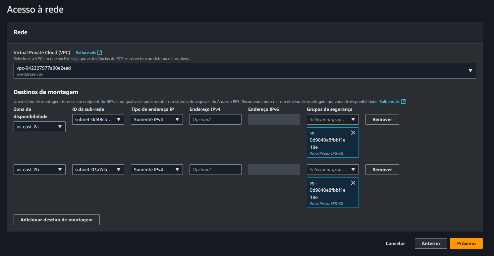

Na AWS procure na barra de pesquisa **EFS** e clique em **Criar sistema de arquivos**

- Nome: efs-wordpress 
- VPC: wordpress-vpc ✅

Clique em **Personalizar**, pode avançar até chegar a aba de **Acesso à rede**
- ID da sub-rede: `WordPress-Private-1`  `WordPress-Private-2`
- Grupo de Segurança: `WordPress-EFS-SG`

**Avance** até a **revisão final**, após isso, clique em **Criar**

