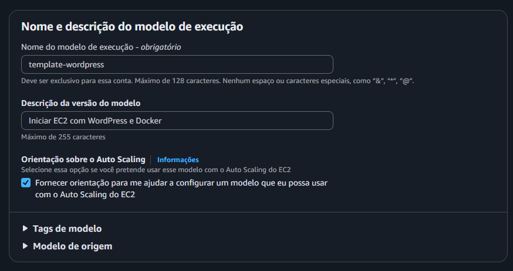
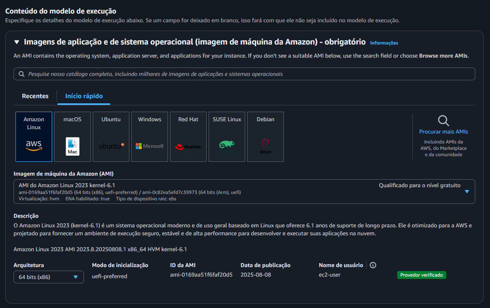
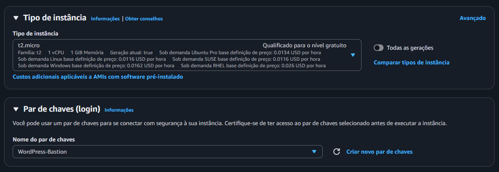
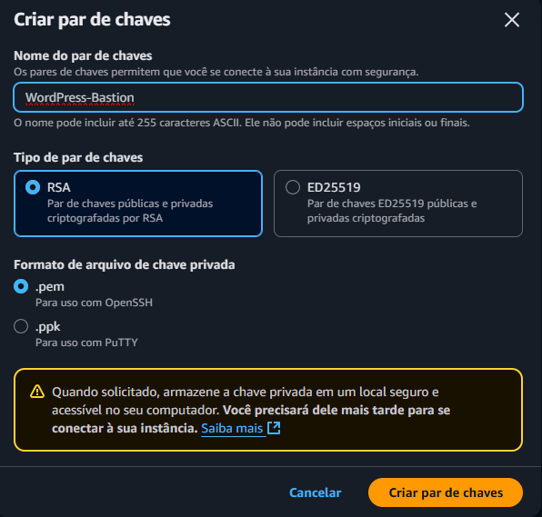
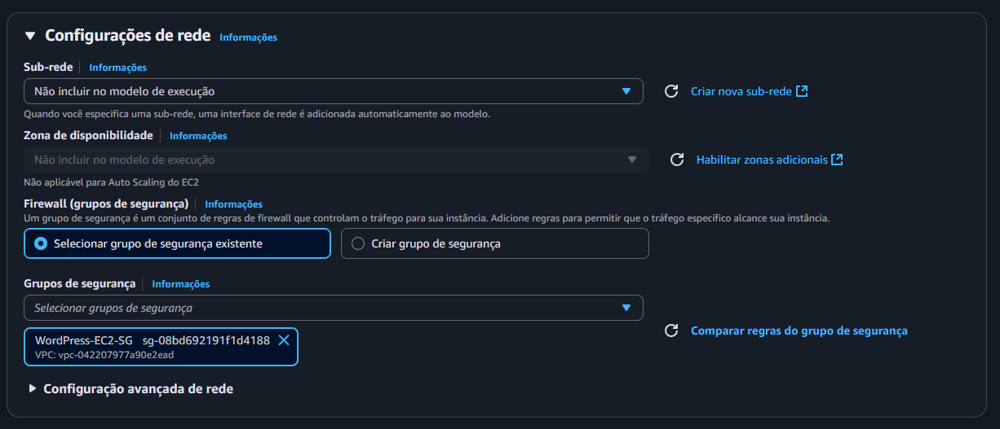
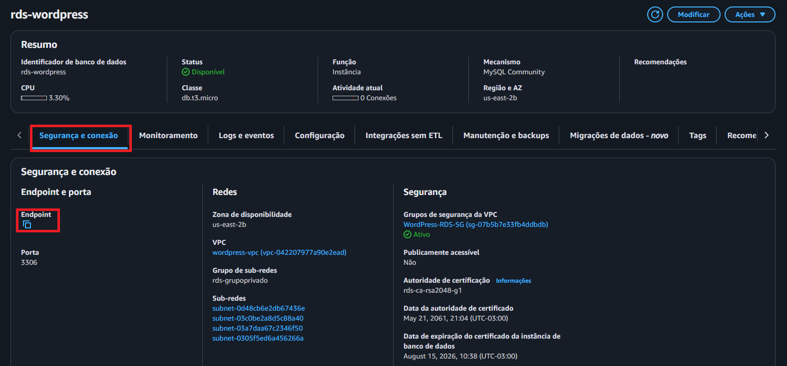

Nessa etapa será criado o modelo de execução para que iniciar uma instância de forma automática com  configurações pré-definidas, sendo elas:
Utilização do User Data para instalar:
- Docker
- Docker Compose
- Montagem do EFS
- Implantar o WordPress através do Docker Compose

Acesse a **AWS > EC2 > Modelos de Execução > Criar modelo de execução**

- Nome: template-wordpress
- Descrição: Iniciar EC2 com WordPress e Docker
- Orientação sobre Auto Scaling: Marque a caixa ✅



Conteúdo do modelo de execução
**Imagens > Início rápido**
- Selecione Amazon Linux
- Tipo de instância: t2.micro ✅
- Par de chaves: Crie uma chave .pem






**Configurações de Rede**
Somente altere o grupo de segurança para o `WordPress-EC2-SG`



**Script User Data**
Deslize até o final e busque a aba **Detalhes avançados**, abra e deslize novamente até o final até localizar uma caixa de texto escrita **Dados do usuário**
Por via das dúvidas é recomendado enviar o arquivo do script .sh, do contrário, insira o script na caixa de texto **(TENHA ATENÇÃO A IDENTAÇÃO DO SCRIPT, PASSÍVEL DE MAL FUNCIONAMENTO)**
Ao inserir o script, crie o modelo de execução

```
#!/bin/bash
sudo su
EFS_DNS="InsiraSeuDNSAqui"

sudo dnf update -y
sudo dnf install -y nfs-utils docker
sudo systemctl start nfs-utils
sudo systemctl enable nfs-utils

DOCKER_COMPOSE_VERSION=$(curl -s https://api.github.com/repos/docker/compose/releases/latest | grep '"tag_name"' | sed -E 's/.*"([^"]+)".*/\1/')
sudo curl -L "https://github.com/docker/compose/releases/download/${DOCKER_COMPOSE_VERSION}/docker-compose-$(uname -s)-$(uname -m)" -o /usr/local/bin/docker-compose
sudo chmod +x /usr/local/bin/docker-compose
sudo usermod -aG docker ec2-user
sudo systemctl start docker
sudo systemctl enable docker

sudo mkdir -p /mnt/efs
sudo mount -t nfs4 -o nfsvers=4.1,rsize=1048576,wsize=1048576,hard,timeo=600,retrans=2,noresvport ${EFS_DNS}:/ /mnt/efs
echo "${EFS_DNS}:/ /mnt/efs nfs4 defaults,tls,_netdev 0 0" | sudo tee -a /etc/fstab

cd /home/ec2-user
cat <<EOF > docker-compose.yml
version: '3.8'

services:
  wordpress:
    image: wordpress:latest
    container_name: wordpress_app
    restart: always
    ports:
      - "80:80"
    environment:
      WORDPRESS_DB_HOST: InsiraSeuEndPoint:3306
      WORDPRESS_DB_USER: InsiraSeuUser
      WORDPRESS_DB_PASSWORD: InsiraSuaSenha
      WORDPRESS_DB_NAME: InsiraONome(Criado em configurações adicionais)
    volumes:
      - /mnt/efs:/var/www/html
EOF

sudo docker-compose up -d
```

Dados sensíveis podem ser adquiridos aos seguintes locais
**EFS**
- AWS > EFS > efs-wordpress 
  Ao acessar o EFS, localize `Nome de DNS`, copie e cole no script em EFS_DNS


**RDS**
- DB_USER: 
- DB_PASSWORD: senha
- DB_NAME: **Criado nas configurações adicionais**
- AWS > RDS > rds-wordpress
  Ao acessar o RDS, localize na aba Segurança e conexão `Endpoint`, copie e cole no script em WORDPRESS_DB_HOST



