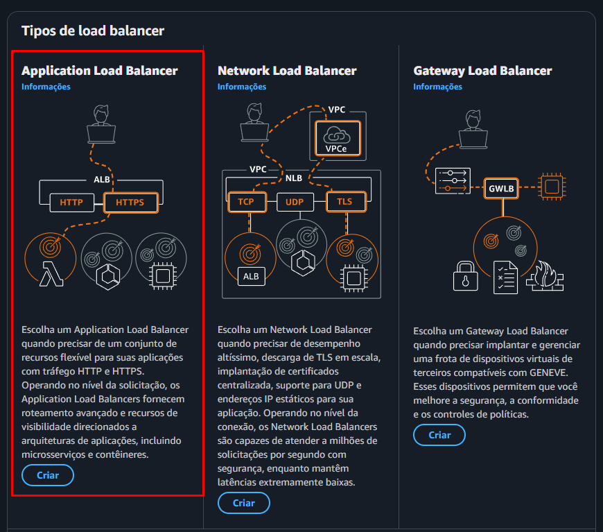
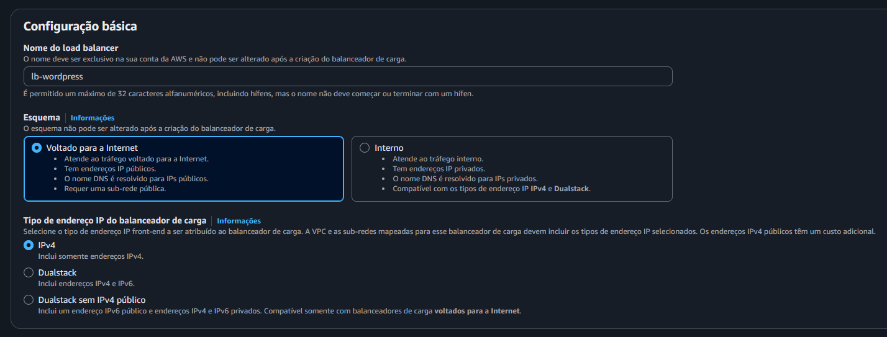
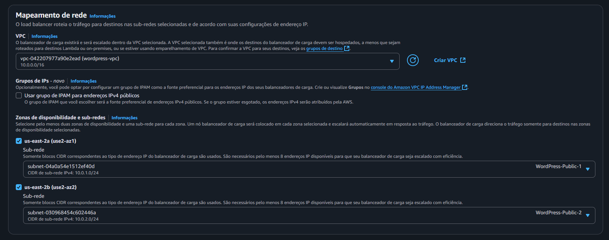
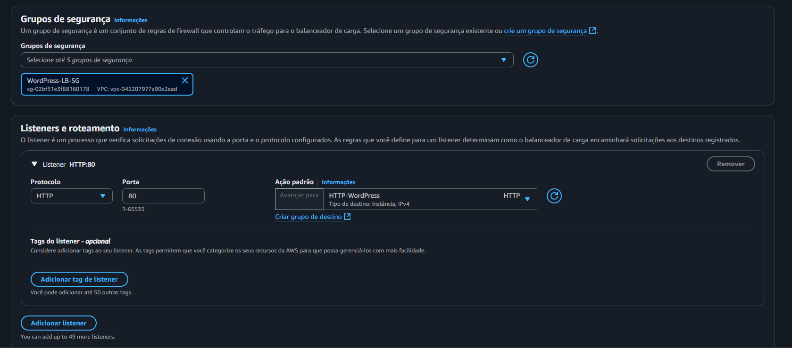
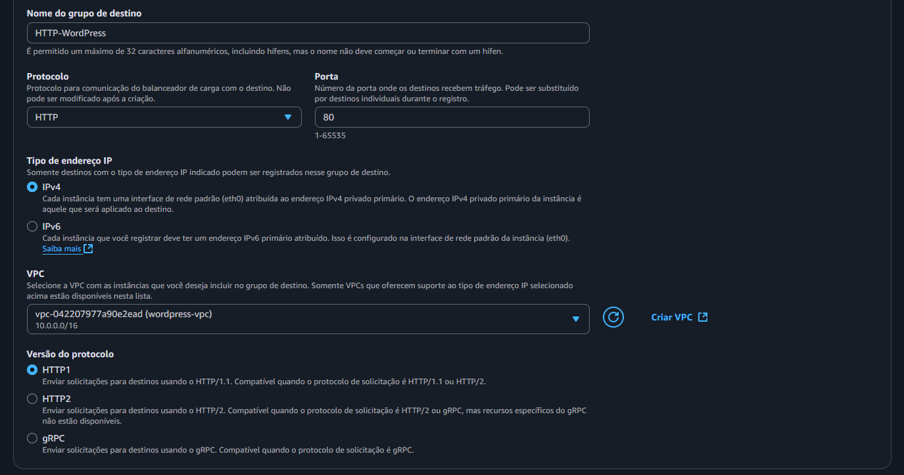
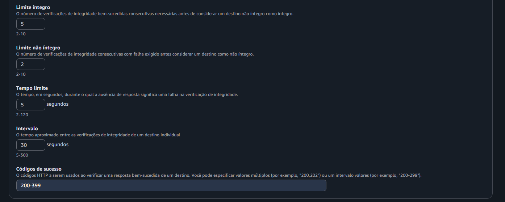

Nessa etapa será criado o Application Load Balancer, que terá o intuito de distribuir o tráfego entre as instâncias EC2
Acesse em **AWS > EC2 > Load Balancers > Criar Load Balancer**
Clique no botão de criar no Application Load Balancer

Configuração do Load Balancer
- Nome: lb-wordpress
- Esquema: Voltado para a internet ✅

Mapeamento de rede
- VPC: wordpress-vpc (se configurada corretamente, será possível seleciona-la)
- Zona de disponibilidade e sub-redes:
  us-east-2a ✅
  sub-rede: `WordPress-Public-1`
  us-east-2b ✅
  sub-rede: `WordPress-Public-2`

Grupo de segurança
    `WordPress-LB-SG`
    **Desmarque o grupo default**

Listeners e roteamento
Abaixo de ação padrão clique em **Criar grupo de destino**, uma nova aba será aberta
- Instâncias ✅
- Nome do grupo de destino: `HTTP-WordPress`
- VPC: wordpress-vpc
Configurações avançadas de verificação de integridade
Deslize até achar **códigos de sucesso**: 
- Insira: 200-399

Clique em Próximo e Criar grupo de destino. Retornando a aba de criação do Load Balancer, clique no botão de recarregar em **Ação Padrão**

Ao finalizar, deslize até embaixo e clique em Criar Load Balancer