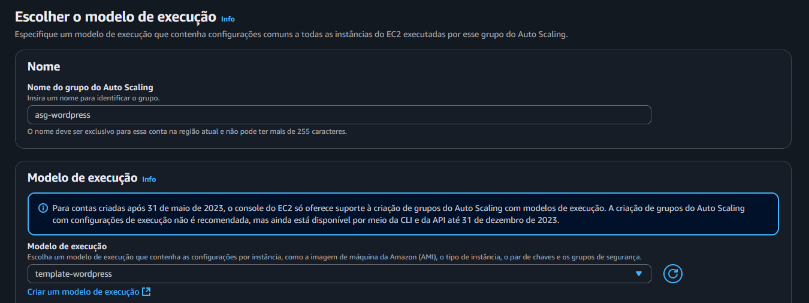

Nessa etapa será criado o auto scaling group, que tem a finalidade de garantir escalabilidade e disponibilidade do WordPress, criando, removendo e balanceando instâncias, usufruindo do Launch Template

Acesse a **AWS > EC2 > Auto Scaling Groups**
- Nome: asg-wordpress
- Modelo de execução: template-wordpress ✅(modelo de execução criado)

Clique em Próximo

Rede
- VPC: wordpress-pvc
- Zonas de disponibilidade e sub-redes:
    us-east-2a ✅

    sub-rede: `WordPress-Private-1`
  
    us-east-2b ✅

    sub-rede: `WordPress-Private-2` `WordPress-Private-3` `WordPress-Private-4` 

- Distribuição da zona de disponibilidade: Melhor esforço equilibrado ✅

Clique em Próximo
Balanceamento de carga
Selecione: **Anexar a um balanceador de carga existente**

Anexar a um balanceador de carga existente
**Escolha entre seus grupos de destino de balanceador de carga** ✅
Grupos de destino de balanceador de cargas existentes
**HTTP-WordPress** ✅

Deslize até chegar em Verificações de integridade
Marque a caixa: **Ative as verificações de integridade do Elastic Load Balancing** ✅
**Período de tolerância da verificação de integridade**: 300 segundos ✅

Clique em Próximo

Tamanho do grupo
- Capacidade desejada: 2
Escalabilidade
- Capacidade mínima desejada: 2
- Capacidade máxima desejada: 4

Deslize até Configurações adicionais
- Monitoramento: Habilite a coleta de métricas de grupo no CloudWatch ✅

Clique em Próximo até Criar grupo do Auto Scaling
