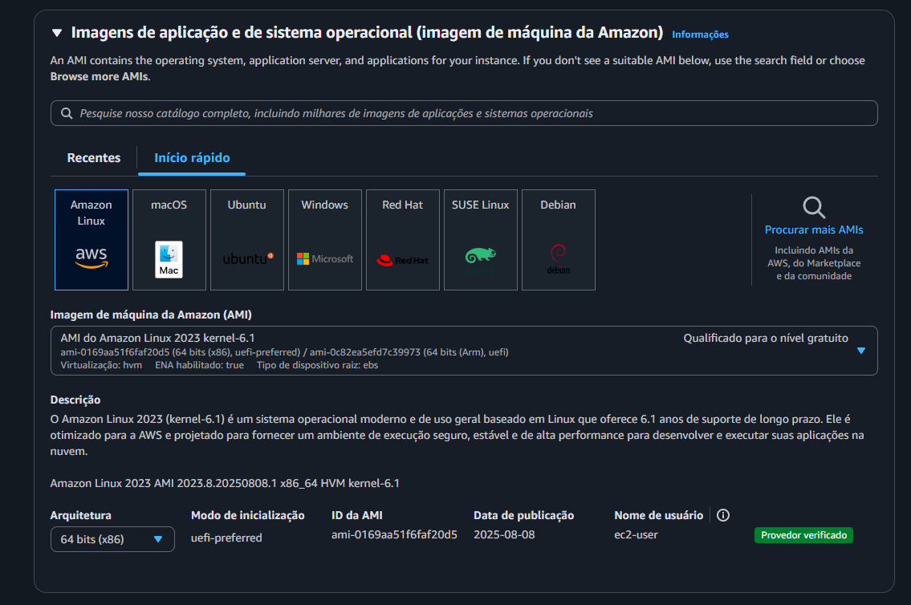
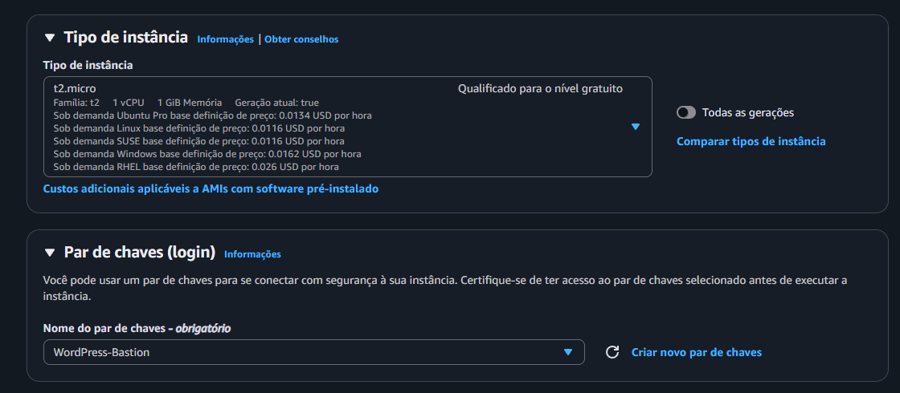
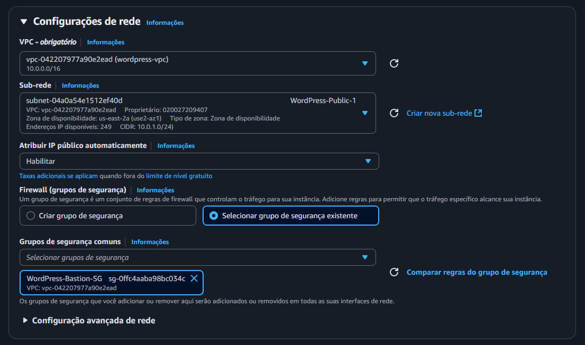
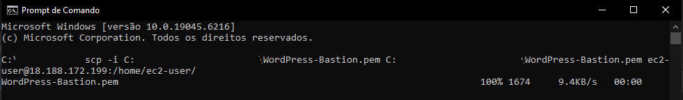
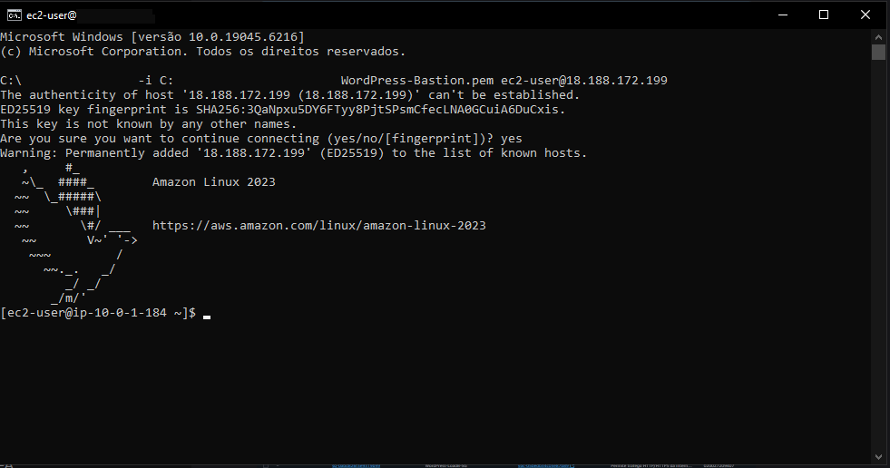
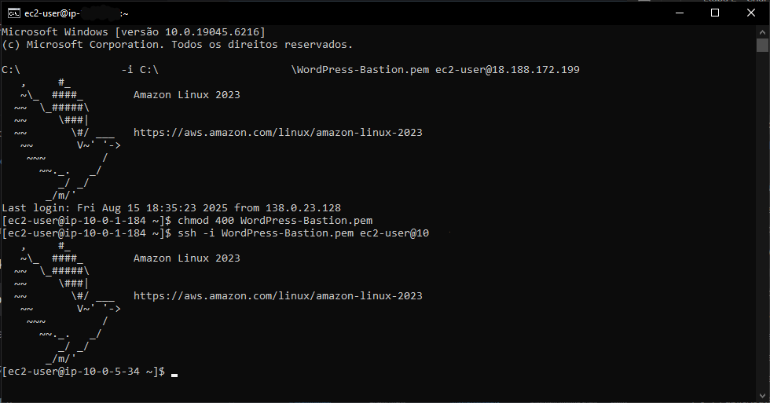
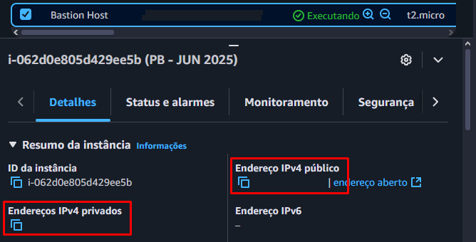

Acesse as instâncias acessando **AWS > EC2 > Instâncias > Criar Instância**
Nome e tags: Defina um nome

Imagens de aplicação
- Inicio rápido: Amazon Linux

Tipo de instância: t2.micro ✅
Par de chaves: WordPress-Bastion (o mesmo do launch template)

Configuração de rede
Clique em Editar
- VPC: wordpress-vpc
- Sub-rede: WordPress-Public-1
- Atribuir IP público automaticamente: Habilitado ✅
Selecionar grupo de segurança existente: WordPress-Bastion-SG

Ao preencher, clique em Criar instância
Para enviar a key do seu computador para o Bastion Host é necessário utilizar o seguinte comando:
`scp -i C:\Caminho\para\sua\chave.pem C:\Caminho\para\sua\chave.pem ec2-user@<IP_PUBLICO_DO_BASTION_HOST>:/home/ec2-user/`

Para conectar ao Bastion é possível realizar através do próprio CMD do seu computador
`ssh -i C:\Caminho\para\sua\chave.pem> ec2-user@<IP_PUBLICO_DO_BASTION_HOST>`

Dentro da Bastion Host é necessário dar permissão para a key ser utilizado, sendo assim, utilize: 
`chmod 400 WordPress-Bastion.pem`
É normal que não retorne nada no console, após essa permissão ser concedida, pode logar na instância

Agora para entrar na instância privada através do Bastion Host, utilize o comando
`ssh -i C:\Caminho\para\sua\chave.pem ec2-user@<IP_PRIVADO_DA_INSTANCIA_PRIVADA>`

Para localizar os respectivos IP's, basta acessar as instâncias em **AWS > EC2 > Instâncias**, clique na instância que você precisa localizar o IP e veja abaixo na aba detalhes em
- Endereço IPv4 público
- Endereços IPv4 privados

