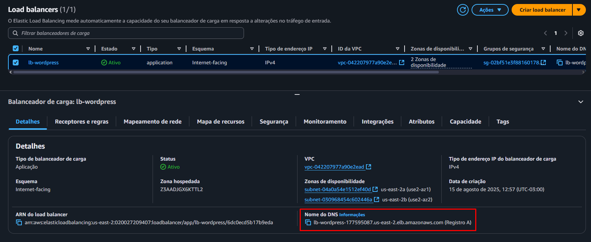
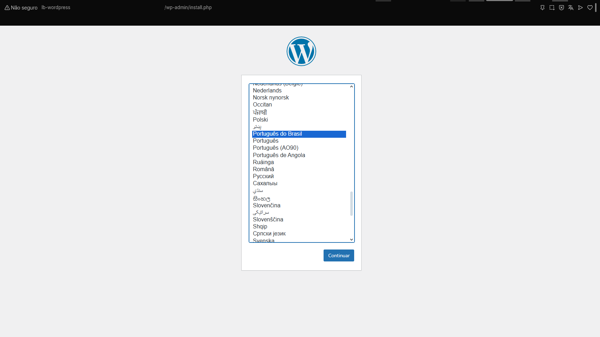
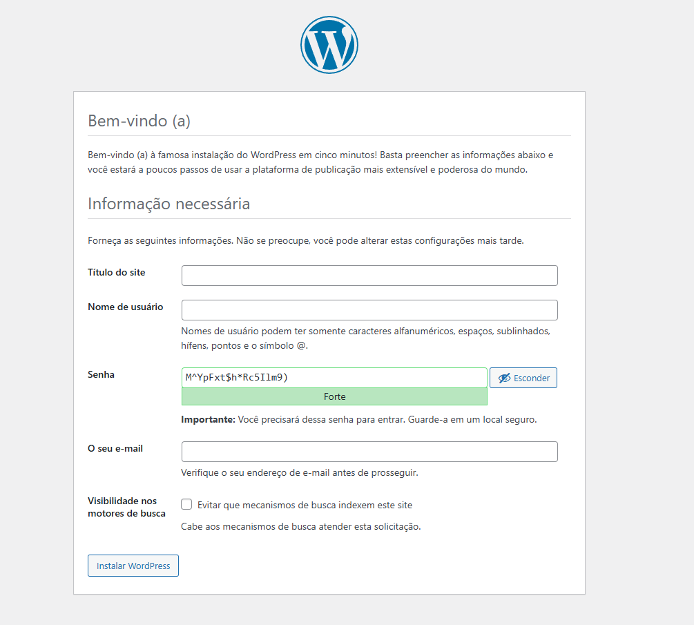
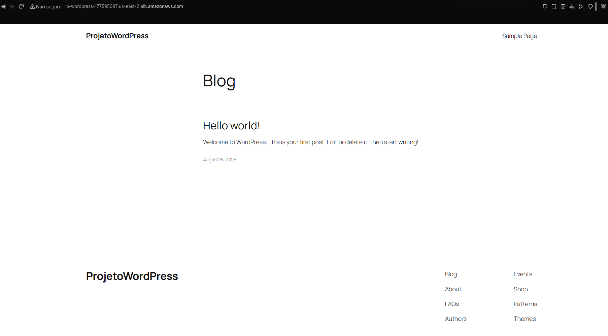

Acesse a aba do Load Balancer em **AWS > Load Balancer**, selecione o Load Balancer criado
Localize a aba **Detalhes** e busque por Nome do DNS, copie e cole na url do browser para ter acesso ao site.

Ao utilizar a url do DNS do Load Balancer, deverá retornar essa página

Agora basta dar continuidade realizando o cadastro no WordPress

Em poucos cliques você terá o seu blog padronizado pelo próprio WordPress!

