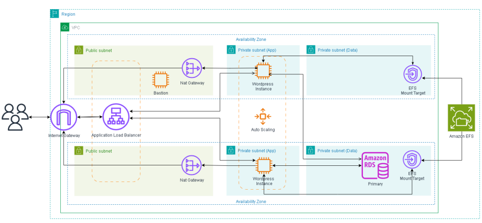

Descrição
-------------------------------------------------------------------------------------------------------------
Com o crescimento contínuo do uso de aplicações web, garantir alta disponibilidade, escalabilidade e resiliência se tornou essencial em qualquer arquitetura moderna. Neste projeto, vamos implantar a plataforma WordPress na nuvem AWS de forma escalável e tolerante a falhas, utilizando os principais serviços gerenciados da AWS para garantir desempenho e disponibilidade.

Arquitetura do Projeto
-------------------------------------------------------------------------------------------------------------

Tecnologias Usadas
-------------------------------------------------------------------------------------------------------------
`☁️AWS` `☁️Amazon EC2` `🗄️RDS MYSQL` `☁️Amazon EFS` `🚦Application Load Balancer` `🐳Docker` `📦Docker Compose` `⚖️Auto Scaling` `WordPress` `Markdown` `💻CMD` `🐚Bash` `YAML` `🐧Amazon Linux 2023` `🐙Github` 

-------------------------------------------------------------------------------------------------------------
### Desenvolvido por
[Igor Macêdo](https://www.linkedin.com/in/https://www.linkedin.com/in/macedoigorr/)